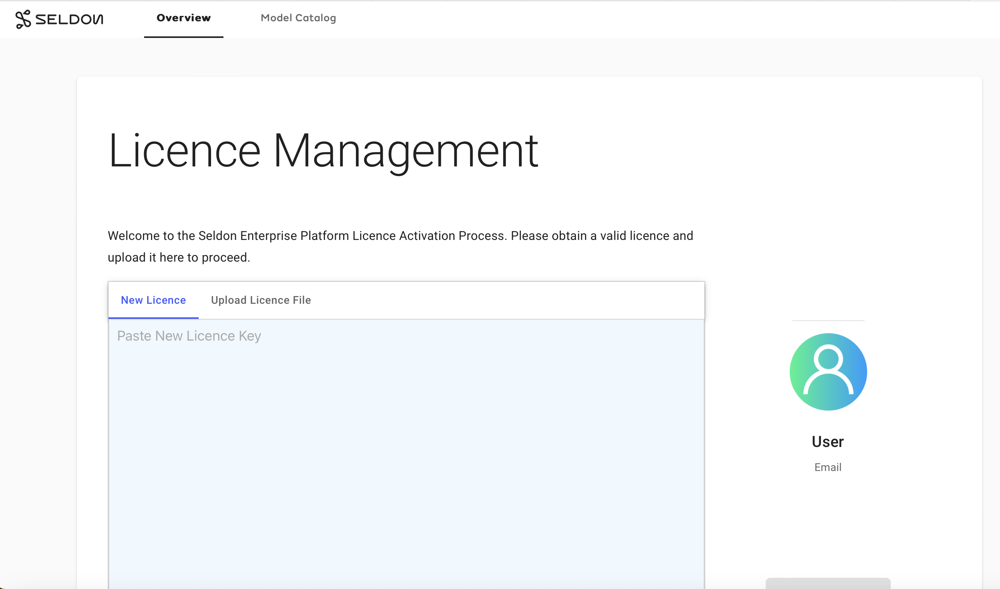

# Installation of Seldon Enterprise Platform 

You can deploy Seldon Enterprise Platform on your local computer that is running a Kubernetes
cluster using [kind][kind-docs], or [minikube][minikube-docs].
 

**Note**: These instructions are designed for deploying the Seldon Enterprise Platform on a local Kubernetes cluster, with an emphasis on ease of learning. For deploying Seldon Enterprise Platform in a production environment, see [cluster requirements][cluster-requirements].
  

## Prerequisites

* Deploy a Kubernetes cluster that is running version 1.23 or later.
* Install [kubectl][kubectl-docs], the Kubernetes command-line tool.
* Install [Helm][helm-docs], the package manager for Kubernetes.
* Seldon Enterprise Platform license key. You can reach out to Seldon [support team][contact] to get a trail license key. 

### Installating Seldon Enterprise Platform on a Kubernetes cluster

To deploy Seldon Enterprise Platform:

1. Create the namespace `seldon-system` to contain the main components of Seldon.
   ```bash
   kubectl create ns seldon-system || echo "Namespace seldon-system already exists"
   ```

1. Create the namespace `seldon-logs` to contain the components related to request logging.
   ```bash
   kubectl create ns seldon-logs || echo "Namespace seldon-logs already exists"
   ```

1. Add the Helm charts `seldon-charts` to the repository and update it.
   ```bash
   helm repo add seldon-charts https://seldonio.github.io/helm-charts/
   helm repo update seldon-charts
   ```

1. Create the `deploy-values` YAML file to specify the initial configuration. Use your preferred text editor to create and save the file with the following content:
   ```yaml
   image:
     image: seldonio/seldon-deploy-server:2.3.1
   
   rbac:
     clusterWide: true
   
   virtualService:
     create: false
   
   requestLogger:
     create: false
   
   gitops:
     argocd:
       enabled: false
   
   enableAppAuth: false
   
   elasticsearch:
     basicAuth: false
   
   seldon:
     enabled: false
     knativeEnabled: false
   
   seldonCoreV2:
     enabled: false
   ```

1. Ensure that you are in the directory that contains the `deploy-values.yaml` file and then deploy Seldon Enperprise Platform in the name space `seldon-system`.
   ```bash
   helm install seldon-enterprise seldon-charts/seldon-deploy --namespace seldon-system  -f deploy-values.yaml --version 2.3.1
   ```

   When the deployment is successful, you should see this:

   ```bash
   NAME: seldon-enterprise
   LAST DEPLOYED: Fri Jul 26 16:43:44 2024
   NAMESPACE: seldon-system
   STATUS: deployed
   REVISION: 1
   NOTES:
   1. Get the application URL by running these commands:
     export POD_NAME=$(kubectl get pods --namespace seldon-system -l "app.kubernetes.io/name=seldon-deploy,app.kubernetes.io/instance=seldon-enterprise" -o jsonpath="{.items[0].metadata.name}")
     echo "Visit http://127.0.0.1:8000/seldon-deploy/ to use your application"
     kubectl port-forward $POD_NAME 8000:8000 --namespace seldon-system
   ```

 1. Check the status of the deployment `seldon-enterprise-seldon-deploy`.
     ```bash
     kubectl rollout status deployment/seldon-enterprise-seldon-deploy -n seldon-system
    ```

    When the deployment is complete you should see this:
    ```bash
    deployment "seldon-enterprise-seldon-deploy" successfully rolled out
    ```

  1. Get the Pod that is running in the deployment in the clsuter and save it as `$POD_NAME`.
     ```bash
     export POD_NAME=$(kubectl get pods --namespace seldon-system -l "app.kubernetes.io/name=seldon-deploy,app.kubernetes.io/instance=seldon-enterprise" -o jsonpath="{.items[0].metadata.name}")
     ```

1. You can use port-forwarding to access your application.
   ```bash
   kubectl port-forward $POD_NAME 8000:8000 --namespace seldon-system
   ```
   
1. Open your browser and navigate to  `http://127.0.0.1:8000/seldon-deploy/` to access Seldon Enterprise Platform.

   

## Additional Resources

* Seldon Core Documentation
* Seldon Enterprise Documentation


[kind-docs]: https://kubernetes.io/docs/tasks/tools/#kind
[minikube-docs]: https://kubernetes.io/docs/tasks/tools/#minikube
[kubectl-docs]: https://kubernetes.io/docs/tasks/tools/#kubectl
[helm-docs]: https://helm.sh/docs/intro/install/
[contact]: https://www.seldon.io/contact
[cluster-requirements]: https://deploy.seldon.io/en/v2.3/contents/getting-started/index.html#cluster-requirements 
